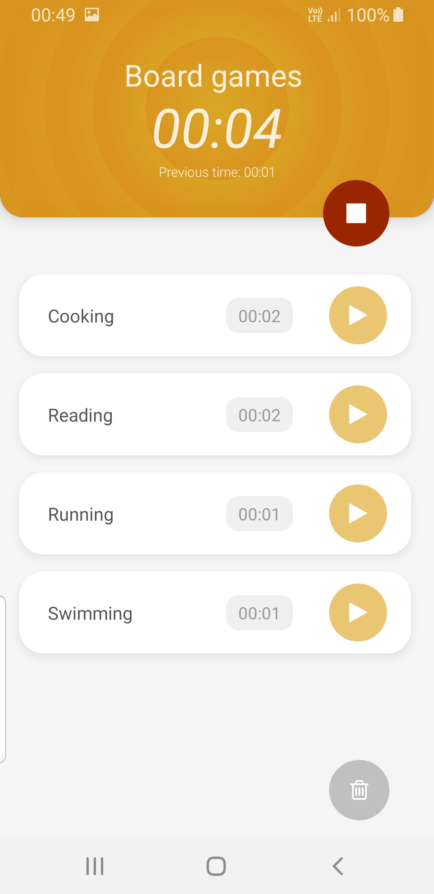
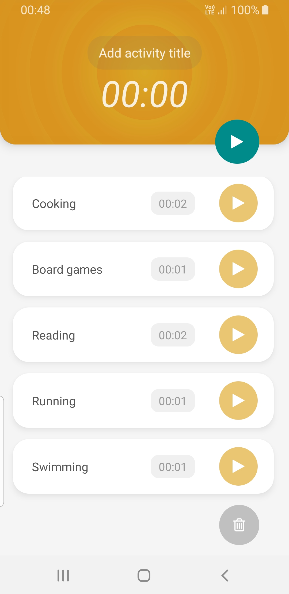

# ⏳ Time Tracker

## This is repo for Time Tracker React Native app

Time tracker allows backing to count time even if the application is killed 🥳.
You can display details of the time tracker or run it again to count new record.
You can save multiple sessions for a single time tracker. You can also check detailed information for all sessions in a modal window.

[](https://play.google.com/store/apps/details?id=com.timeTracker)

## Preview

<div>


</div>

## 🚀 Getting started:

Clone the repo:

```bash
git clone https://github.com/nata-kab/TimeTracker.git
```

and then:

```bash
cd TimeTracker
npm i
cd ios && pod install && cd ..
```

and to run project:

```bash
npx react-native start # starts Metro Bundler
npx react-native run-android # run app on android device / simulator
npx react-native run-ios # run app on iOS device / simulator
```
